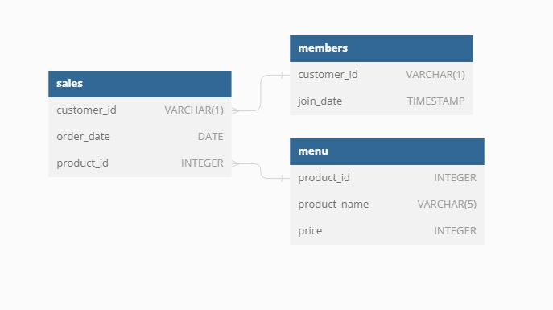

# SQL-Challenge Week 1 Dannys-Diner

## Table of Contents
- [Introduction]()
- [Problem Statement]()
- [Entity Relationship Diagram]()
- [Business Case Solutions]()

## Introduction
Danny seriously loves Japanese food so in the beginning of 2021, he decides to embark upon a risky venture and opens up a cute little restaurant that sells his 3 favourite foods: sushi, curry and ramen.

Danny’s Diner is in need of your assistance to help the restaurant stay afloat - the restaurant has captured some very basic data from their few months of operation but have no idea how to use their data to help them run the business.

The aim of this analysis is to assist Danny in gaining a deeper understanding of his customers' needs and desires, as well as making well-informed decisions regarding the current customer loyalty program, by offering effective business solutions. 

_For the full challenge kindly click [here](https://8weeksqlchallenge.com/case-study-1/)_

## Problem Statement
Danny seeks to utilize the data to address several inquiries concerning his customers, particularly their visitation patterns, expenditure amounts, and preferred menu items. Establishing a deeper connection with his clientele will enable him to provide enhanced and personalized experiences for his loyal customers.

He intends to employ these insights in determining the viability of expanding the current customer loyalty program. Furthermore, he requires assistance in generating basic datasets that his team can conveniently examine without relying on SQL.

## Entity Relationship Diagram

**_The Entity Relationship diaagram shows the relationships and connections between all tables in the database._**
